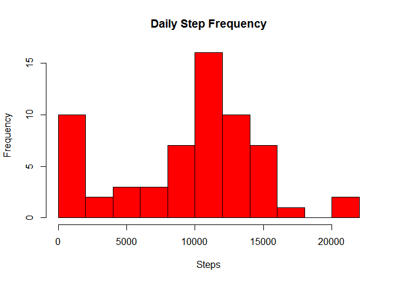
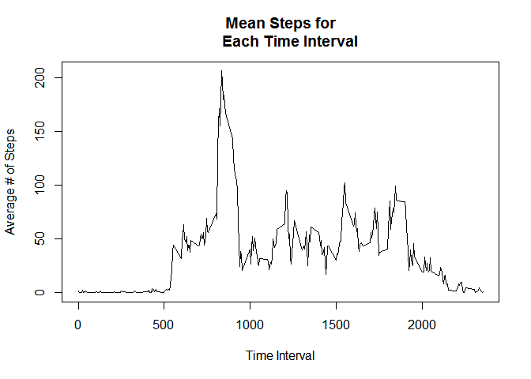
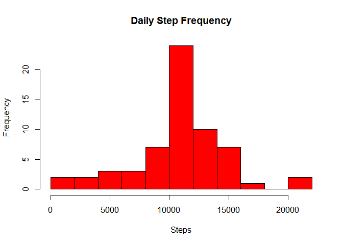
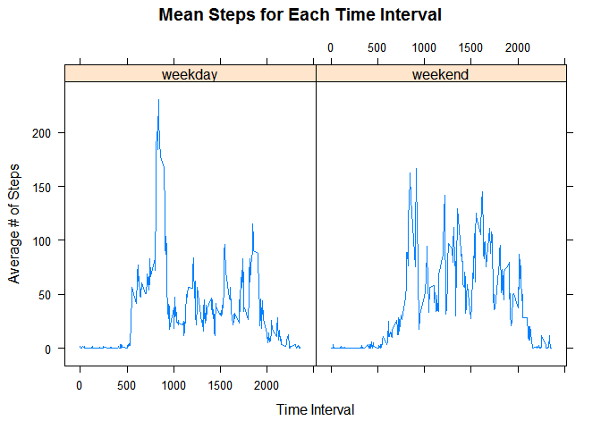

# Reproducible Research: Peer Assessment 1


## Loading and preprocessing the data


```r
data <- read.csv("activity.csv", header = TRUE)
dailySteps <- aggregate(data$steps, by = list(data$date), FUN="sum", na.rm=TRUE)
```

## What is mean total number of steps taken per day?


```r
hist(dailySteps[,2], breaks = 15, col = "red", main = "Daily Step Frequency", 
     xlab = "Steps")
```

 

```r
meanSteps <- mean(dailySteps[,2])
medianSteps <- median(dailySteps[,2])

meanSteps
```

```
## [1] 9354.23
```

```r
medianSteps
```

```
## [1] 10395
```

## What is the average daily activity pattern?

```r
dailyStepPattern <- aggregate(data$steps, by = list(data$interval), FUN="mean",
    na.rm=TRUE)
plot(dailyStepPattern$Group.1,dailyStepPattern$x, type = "l", 
     xlab = "Time Interval", ylab = "Average # of Steps", main = "Mean Steps for
     Each Time Interval")
```

 


###Time Interval with Maximum Average Step Count:

```r
dailyStepPattern[dailyStepPattern$x == max(dailyStepPattern$x),1]
```

```
## [1] 835
```


## Imputing missing values
Calculate and report the total number of missing values in the dataset (i.e. the
total number of rows with NAs)

```r
NAs <- data[is.na(data$steps),]
nrow(NAs)
```

```
## [1] 2304
```

Devise a strategy for filling in all of the missing values in the dataset. The 
strategy does not need to be sophisticated. For example, you could use the 
mean/median for that day, or the mean for that 5-minute interval, etc.

Create a new dataset that is equal to the original dataset but with the missing 
data filled in.

```r
#We will replace missing values with the median for the corresponding interval 
#among non-missing observations
impData <- data
for (i in (1:nrow(impData))){
    if (is.na(impData$steps[i])){
        timeSlot <- impData$interval[i]
        slotMedian <- dailyStepPattern[dailyStepPattern$Group.1 == timeSlot,2]
        impData$steps[i] <- slotMedian
    }
}
```

Make a histogram of the total number of steps taken each day and Calculate and 
report the mean and median total number of steps taken per day. Do these values 
differ from the estimates from the first part of the assignment? What is the 
impact of imputing missing data on the estimates of the total daily number of 
steps?


```r
impDailySteps <- aggregate(impData$steps, by = list(impData$date), FUN="sum", 
                           na.rm=TRUE)
mean(impDailySteps[,2])
```

```
## [1] 10766.19
```

```r
median(impDailySteps[,2])
```

```
## [1] 10766.19
```

```r
hist(impDailySteps[,2], breaks = 15, col = "red", main = "Daily Step Frequency", 
     xlab = "Steps")
```

 

The data with imputed missing values had many fewer days with very low step
counts. This is consistent with the hypothesis that daily step counts are 
normally distruted, and missing values are more common on some days than others. 
## Are there differences in activity patterns between weekdays and weekends?
Create a new factor variable in the dataset with two levels - "weekday" and 
"weekend" indicating whether a given date is a weekday or weekend day.


```r
impData$date <- as.Date(impData$date)
for (i in 1:nrow(impData)){
    if (weekdays(impData$date[i]) %in% c("Saturday","Sunday")){
        impData$dayType[i] <- "weekend"
    } else {
        impData$dayType[i] <- "weekday"
    }
}
```

Make a panel plot containing a time series plot (i.e. type = "l") of the 
5-minute interval (x-axis) and the average number of steps taken, averaged 
across all weekday days or weekend days (y-axis). See the README file in the 
GitHub repository to see an example of what this plot should look like using 
simulated data.


```r
library(lattice)
impDailyStepPattern <- aggregate(impData$steps, by = list(impData$interval,
    impData$dayType), FUN="mean")
xyplot(x ~ Group.1 | Group.2 , impDailyStepPattern, type = "l",
       xlab = "Time Interval", ylab = "Average # of Steps",
       main = "Mean Steps for Each Time Interval")
```

 

